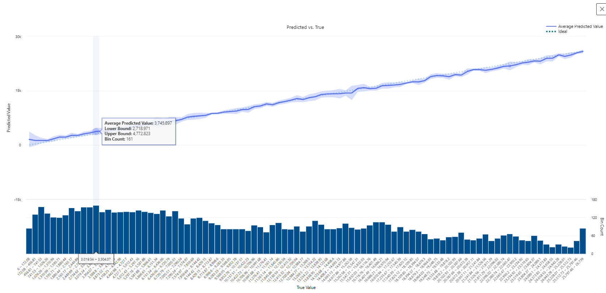
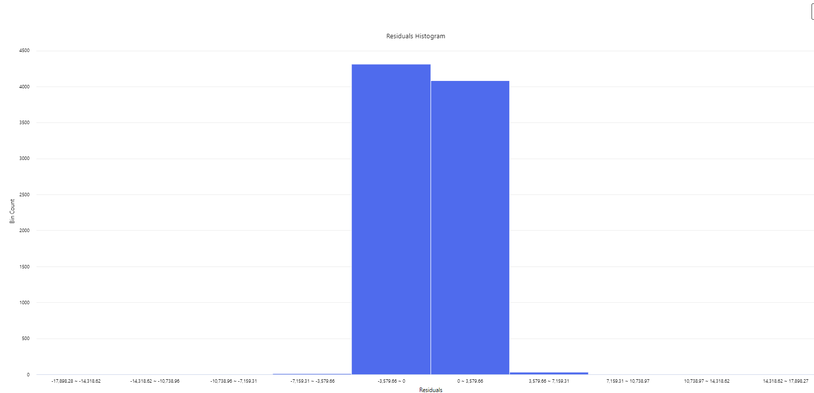

# Dio-Machine-Learning-

  # Vendas de propriedades em Nova York
    Um ano(2017) de propriedades vendidas no mercado imobiliário de Nova York

-- Este conjunto de dados é um registro de todos os edifícios ou unidades de construção (apartamento, etc.) vendidos no mercado imobiliário da cidade de Nova York durante um período de 12 meses.

  Este conjunto de dados contém a localização, endereço, tipo, preço de venda e data de venda das unidades de construção vendidas. Uma referência sobre os campos mais complicados:

   # BOROUGH:
    Um código de dígito para o bairro em que a propriedade está localizada; em ordem, estão Manhattan (1), Bronx (2), Brooklyn (3), Queens (4) e Staten Island (5).

   # BLOCK; LOT: 
     A combinação de bairro, quarteirão e lote forma uma chave única para a propriedade na cidade de Nova York. Comumente chamado de .BBL

  # BUILDING CLASS AT PRESENT  :
    O tipo de edifício em vários pontos no tempo. Veja o glossário vinculado abaixo.BUILDING CLASS AT TIME OF SALE
Para obter mais referências sobre campos individuais, consulte o Glossário de Termos. Para os códigos de classificação de edifícios, consulte o Glossário de Classificações de Edifícios.

  # Observe que, como esse é um conjunto de dados de transações financeiras, há alguns pontos que precisam ser lembrados:

    Muitas vendas ocorrem com uma quantia absurdamente pequena em dólares: $ 0 mais comumente. Essas vendas são, na verdade, transferências de escrituras entre as partes: por exemplo, pais que transferem a propriedade de sua casa para um filho depois de se mudarem para a aposentadoria.
Este conjunto de dados usa a definição financeira de um edifício/unidade de construção, para fins fiscais. 

markdown
markdown

